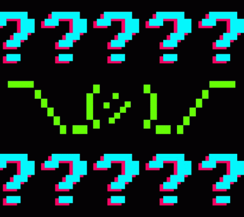
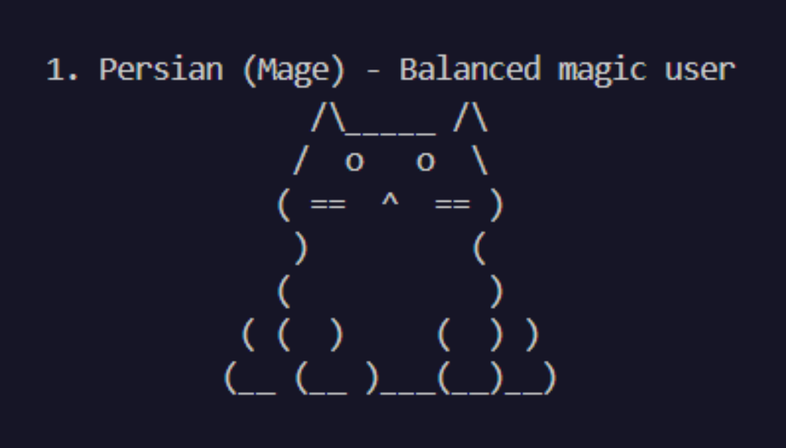
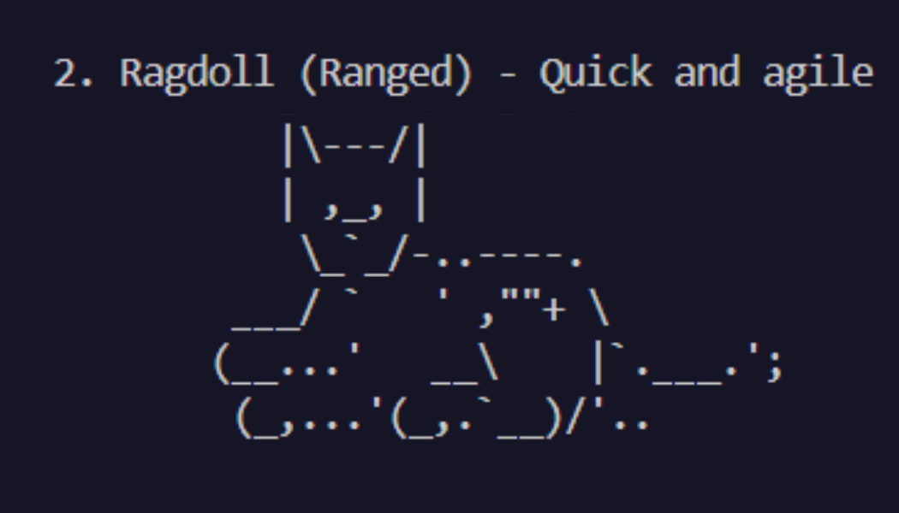
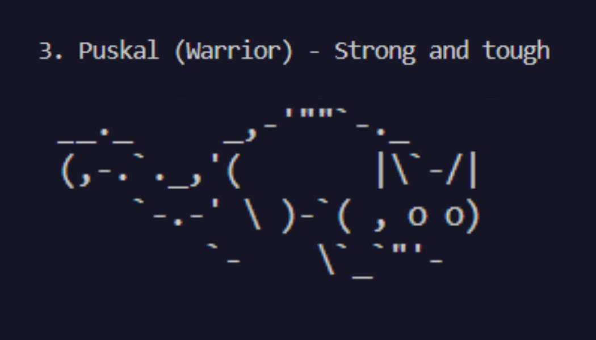
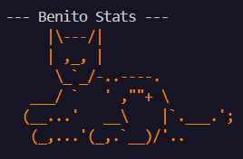
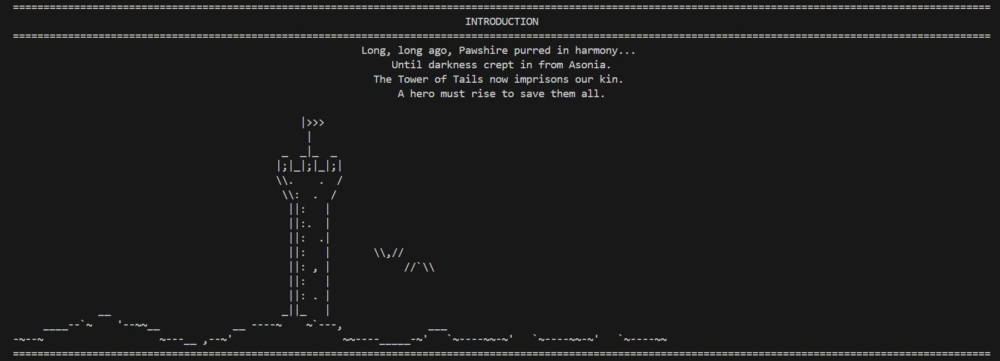
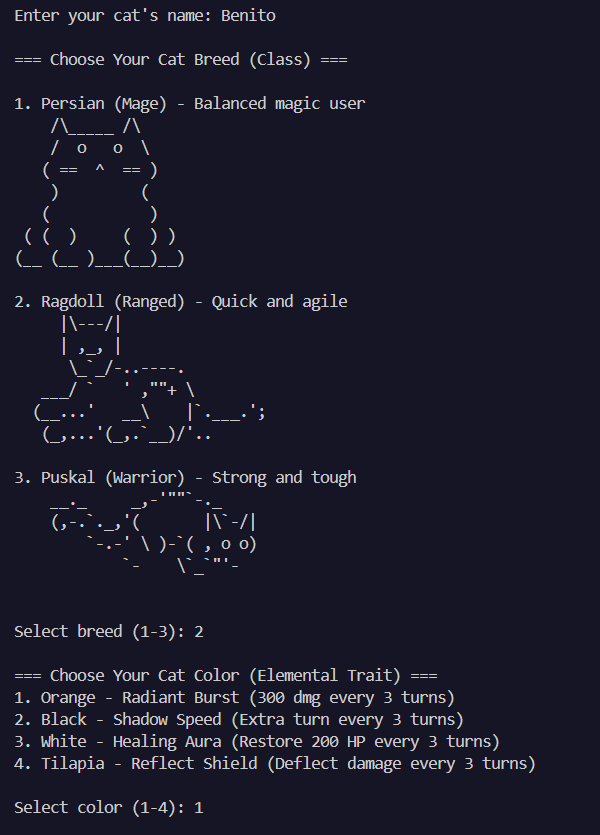
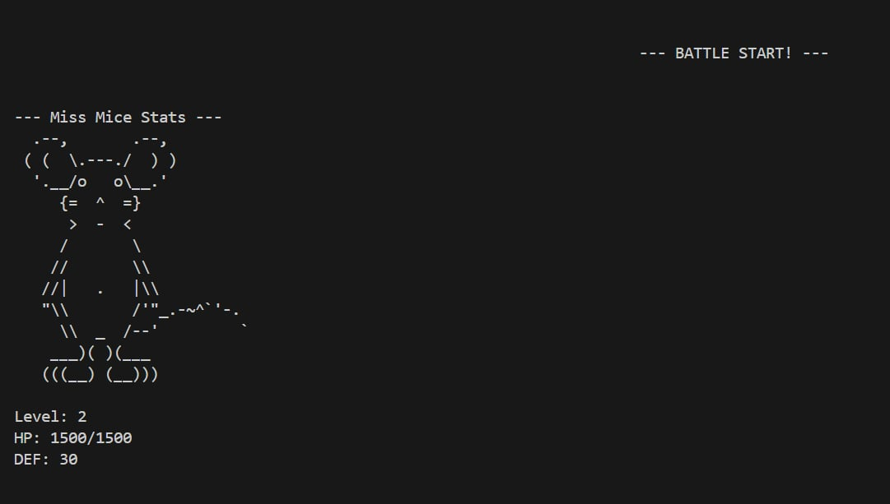
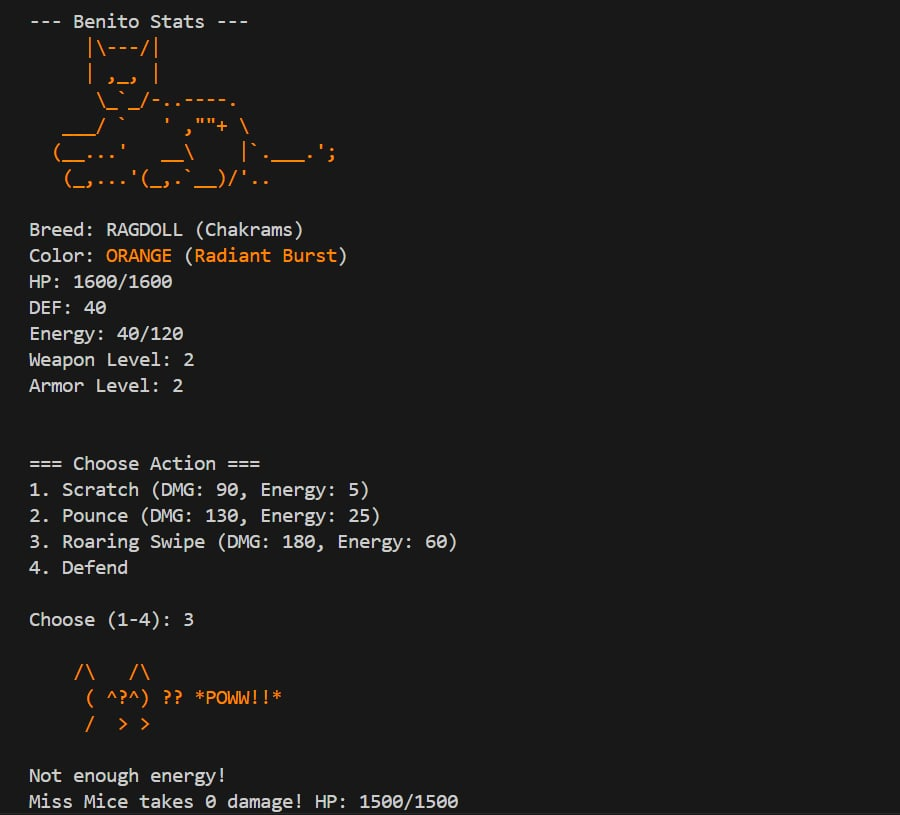

<h1 align="center">
  /ᐠ > ˕ <マ MeowsterQuest ₊˚⊹♡
</h1>

<p align="center">
  
</p>


# **⋆🐾° ┊ Description** 📃
#### MeowsterQuest is a turn-based RPG loop of exploration, combat, and rewards to keep gameplay engaging. It solves the problem of repetitive RPGs by combining strategic battles with a clear progression, letting players rescue captured citizens and restore peace to Pawshire.

#### It demonstrates the practical use of Object-oriented Programming (OOP) concepts such as encapsulation, inheritance, polymorphism, and abstraction, alongside proper file handling and modular design.


### WHAT CAN YOU DO?

### Player can:

- Choose Cat Breed
- Customized it by color
- Pick special moves
- Gain Hp and Points
- Win the Battle(eme)

# **⋆🐾° ┊ Game Structure** 
```
📂 src/
└── 📂 combat/
    └── ⚔️ Attack.java          
    └── 🛡️ BattleSystem.java
└── 📂 core/
     └── 👾 Game.java
     └── 📍 Main.java
└── 📂 entity/
    └── 📂 player/
    |   └── 🧬 CatBreed.java
    |   └── 🌈 CatColor.java
    |   └── 🎮 Player.java
    └── 👿 Enemy.java
    └── 🔊 NPC.java
└── 📂 resources/
    └── 📂textprint/
└── 📂 system/
     └── 🐱 Characters.java
     └── 📋 Menu.java
     └── 🏰 Tower.java
└── 📂 util/
     └── 🎨 ColorUtil.java
     └── 🎶 MusicUtil.java
     └── 💬TextUtil.java
```
### 💥 combat/ 
- **`Attack.java`** – Defines attack actions with damage and energy cost attributes.
- **`BattleSystem.java`** – Manages turn-based combat between player and enemy, including special abilities and battle flow.

### 💡 core/
- **`Game.java`** – Oversees game progression, including menu navigation, character creation, and victory sequence.
- **`Main.java`** – Entry point of the program, initializes the game and handles user input.

### 🧩 entity/

  &nbsp;&nbsp;&nbsp;&nbsp; 👥 player/
  - **`CatBreed.java`** – Defines cat breeds (Persian, Ragdoll, Puskal) with weapons, armor, energy, attacks, and ASCII art.
- **`CatColor.java`** – Defines elemental traits (Orange, Black, White, Tilapia) with unique abilities and colored text.
- **`Player.java`** – Represents the player character with stats, attacks, defense, energy, special abilities, and progression.

### 🧩 entity/
- **`Enemy.java`** – Represents enemy characters with stats, ASCII art, and combat behavior.
- **`NPC.java`** – Models non-playable characters with names, roles, and dialogue interactions.

### 📚 resources/ - Stores all ASCII art and music files used in the game.
 &nbsp;&nbsp;&nbsp;&nbsp; 💬 textprint/ - Folder for ASCII art text files
### ⚙️ system/
- **`Character.java`** – Handles character creation, breed and color selection, and NPC encounter scenes.
- **`Menu.java`** – Displays game menus, introduction, victory, and end screens with interactive options.
- **`Tower.java`** – Controls level progression, enemy battles, prisoner rescues, and retry logic.

### 🛠️ util/
- **ColorUtil.java** – Provides color formatting utilities for text output based on cat color traits.
- **MusicUtil.java** - Provides the audio visual used in the background musics in the game and the sound effects used.
- **TextUtil.java** – Offers text display utilities like typewriter effects, centered printing, and screen clearing.


## **How to Run the Game**
<p align="center">
  
</p>

**1. Navigate to the project root**
- #### Open your terminal and go to the root directory of your project (where the `src` folder or packages like `core`, `combat`, etc. are located).
```
cd path/to/MEOWSTERQUEST
```
**2. Compile the Java files**
#### Assuming your source files are inside a `src` folder and follow a package structure (`core`, `combat`, etc.), compile all `.java` files:

```
javac -d bin src\core\Main.java
```
**3. Run the main class** 

#### Your entry point is `core.Main`, so run it using:
```
java core.Main
```
#### Make sure the project is compiled. Then, run the program by pointing Java to the folder with compiled `.class` files:
```
java -cp bin core.Main
```

### **What can YOU do (Features)**
1. **Add info.** Enter the name of your character
#### `Enter your cat's name:`
2. **Select Character.** Can choose the breed and color of the cat by selecting the designated number.

#### `=== Choose Your Cat Breed (Class) ===`

<p align="center">
  
  
  

#### `=== Choose Your Cat Color (Elemental Trait) ===`
</p>
<p align="Center">
  
</p>

3. **Battle Actions.** Player can Attack, Defend, Trigger Special Actions, Regenerate Energy, and Level Up.

4. **Tower Progression.** Fights through a three(3) level tower, Rescue prisoners, Retry battles if defeated, and Interacts with NPC.

5. **Immersion.** Enjoy the ASCII art graphics and the charactersirics of each Heroes through the **Colors**, and Experience **Typewriter-style dialouge.**


# **⋆🐾° ┊ Object-Oriented Principles**

## 🌌 Abstraction
#### Abstraction is used heavily in classes like TextUtil and MusicUtil, where complex logic for typewriter effects, delays, and sound playback is hidden behind simple method calls such as typewriterPrintCentered or playSFX. This keeps Tower, BattleSystem, and other systems clean and focused on game logic because they don’t need to know how text rendering or audio handling works internally.

## 💊 Encapsulation
#### Encapsulation appears in classes where important variables like player health, enemy stats, sound file paths, and text settings are kept private and are accessed or modified only through methods. This protects game data from accidental misuse, ensures values stay valid, and keeps all changes controlled inside the class itself, making the code safer and more reliable.

## 🦋 Polymorphism
#### Polymorphism is used when the battle system interacts with enemies through the Enemy type while allowing each enemy subclass to override methods like attack, speak, or special moves. This lets the battle system call the same method on different enemy types but get different behaviors depending on the actual object, which makes combat system flexible and easy to expand with new enemies.

## 🧬 Inheritance
#### Inheritance is used in the overall structure of the combat and entity system. Classes such as Player and Enemy extend a common base entity class and share attributes such as health points, attack lists, and names. This allows shared behavior while still supporting unique features for different entity types. This setup also makes the project ready for expansion, since new types of enemies or special player subclasses can easily inherit from the base class.

# **⋆🐾° ┊Game Play (Example Output)**

## /•᷅‎‎•᷄\੭┊ Main Menu 


## /•᷅‎‎•᷄\੭┊ Introduction for the game



## /•᷅‎‎•᷄\੭┊ Character Creation


## /•᷅‎‎•᷄\੭┊ Status of your character


## /•᷅‎‎•᷄\੭┊ Battle in The Tower




# **⋆🐾° ┊Development team (MEO\V3X)**


  
|     | Name   |Roles    |
|-----|--------|---------|
| <div align="center"></div> | Bernardo, Xiamara <br> [](https://github.com/Xiamara23)   | Narrative Designer|
| <div align="center"></div> |Carranceja, Mikyla <br> [](https://github.com/kykylim) | Game Designer |
| <div align="center"></div> |Gupilan, Shanlee Yvonne <br> [](https://github.com/Shanleegupilan8) | Quality Assurance|
| <div align="center"></div> | Mercado, Aaron Daniel <br> [](https://github.com/Aa-ronMer-cado) |Game Programmer  |

 
# **⋆🐾° ┊ Acknowledgement**

### Expressing our sincerest gratitude to:

- **Ms. Fatima Marie M. Agdon** for her guidance, support, and encouragement throughout our OOP Java final project. It helped us improve our skills and better understand programming. We are truly thankful for her lessons, which made it possible for us to complete this project successfully.

- **Classmates (CS-2102)** for collaborating with us and helping share ideas that strengthened our project.

- **Friends** for offering encouragement and insights that guided us throughout the process.

- **Family** for providing unwavering support and motivation that kept us focused and determined.

# **⋆🐾° ┊ References**
<div align= "center"></div>
<h3 align = "center">
  🢁 Mikyla's cat References 🢁

    

# **⋆🐾° ┊ Future Enhancemnts**
### Future enhancments in the future:

- **🎭 Expanded Story** - Add deeper lore, more dialogue choices, and multiple endings.

- **⚔️ Combat Upgrades** - New enemies, status effects, combo attacks, and difficulty modes.

- **💾 Save System** - Add save/load features to continue progress anytime.

- **🎨 GUI Version** - Build a visual interface using JavaFX or HTML/CSS/JS. Add music, effects, and visual feedback during battles, show tower levels and progress visually.

- **📦 Inventory System** - Add items, potions, and gear with drag-and-drop support.

- **🔐 Login System** - Add user authentication to track achievements privately.

<h1 align="center">
  <b>THANK YOU FOR VISITING</b>
</h1>

<h3 align="center">
  <i>Heroes aren’t born, they rise through the fight, In Pawshire’s tale, your legend shines ✨bright✨.</i>
</h3>

<p align="center">
  
</p>
